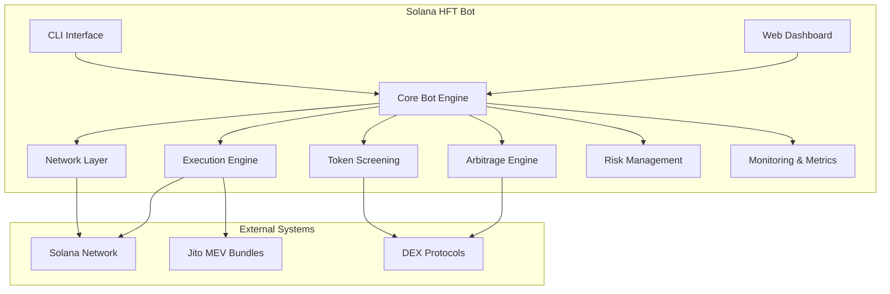
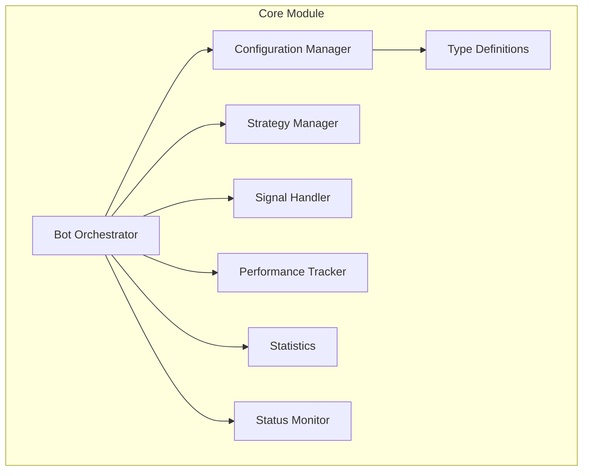
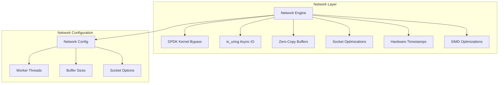
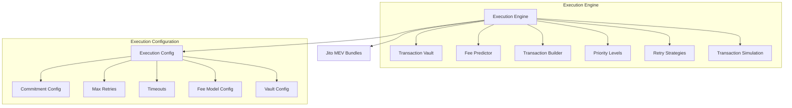
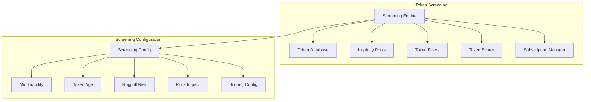
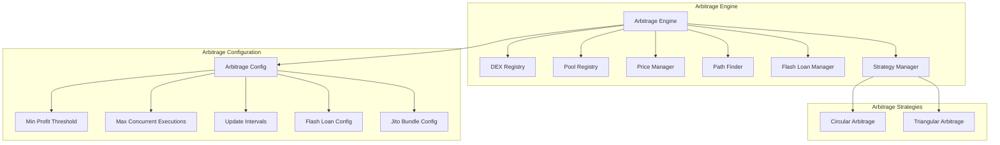
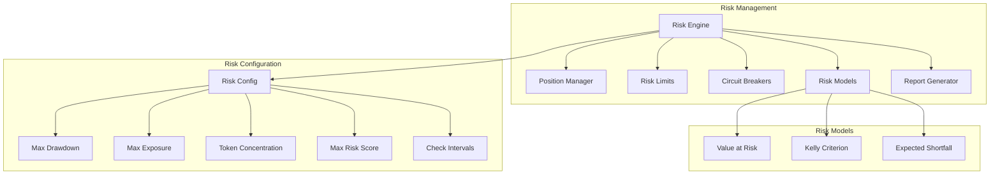
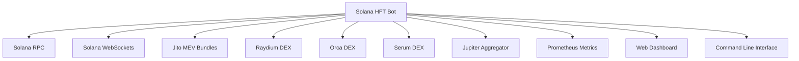

# Solana HFT Bot Architecture

This document provides a comprehensive overview of the Solana HFT Bot architecture, showing the relationships between components and the overall system structure.

## System Overview

## Component Breakdown

### Core Module

### Network Layer

### Execution Engine

### Token Screening

### Arbitrage Engine

### Risk Management

## Configuration Options

### Network Configuration

| Parameter | Description | Default |
|-----------|-------------|---------|
| worker_threads | Number of worker threads | CPU cores |
| use_dpdk | Whether to use DPDK for kernel bypass | false |
| use_io_uring | Whether to use io_uring for async IO | true |
| send_buffer_size | Size of the send buffer | 1MB |
| recv_buffer_size | Size of the receive buffer | 1MB |
| connection_timeout | Connection timeout | 30s |
| keepalive_interval | Keep-alive interval | 15s |
| max_connections | Maximum number of connections | 1000 |

### Execution Configuration

| Parameter | Description | Default |
|-----------|-------------|---------|
| rpc_url | RPC URL | https://api.mainnet-beta.solana.com |
| commitment_config | Commitment level | confirmed |
| skip_preflight | Whether to skip preflight checks | true |
| max_retries | Maximum number of retries | 3 |
| confirmation_timeout_ms | Confirmation timeout | 60000 |
| blockhash_update_interval_ms | Blockhash update interval | 2000 |
| tx_status_check_interval_ms | Transaction status check interval | 2000 |
| use_jito_bundles | Whether to use Jito MEV bundles | false |
| jito_bundle_url | Jito bundle service URL | https://mainnet.block-engine.jito.io |

### Screening Configuration

| Parameter | Description | Default |
|-----------|-------------|---------|
| rpc_url | RPC URL | https://api.mainnet-beta.solana.com |
| rpc_ws_url | Websocket URL | wss://api.mainnet-beta.solana.com |
| min_liquidity_usd | Minimum liquidity in USD | 10000 |
| min_token_age_seconds | Minimum token age in seconds | 3600 |
| max_rugpull_risk | Maximum rugpull risk score | 70 |
| price_impact_threshold | Price impact threshold | 0.05 |
| min_profit_bps | Minimum profit in basis points | 50 |
| token_update_interval_ms | Token update interval | 30000 |
| liquidity_update_interval_ms | Liquidity update interval | 15000 |

### Arbitrage Configuration

| Parameter | Description | Default |
|-----------|-------------|---------|
| rpc_url | RPC URL | https://api.mainnet-beta.solana.com |
| websocket_url | Websocket URL | wss://api.mainnet-beta.solana.com |
| min_profit_threshold_bps | Minimum profit threshold in basis points | 10 |
| max_concurrent_executions | Maximum number of concurrent executions | 5 |
| max_queue_size | Maximum queue size | 100 |
| confirmation_timeout_ms | Confirmation timeout | 30000 |
| price_update_interval_ms | Price update interval | 1000 |
| pool_update_interval_ms | Pool update interval | 5000 |
| opportunity_detection_interval_ms | Opportunity detection interval | 1000 |
| use_flash_loans | Whether to use flash loans | true |
| use_jito_bundles | Whether to use Jito bundles | true |

### Risk Configuration

| Parameter | Description | Default |
|-----------|-------------|---------|
| max_drawdown_pct | Maximum drawdown percentage | 10.0 |
| max_exposure_pct | Maximum exposure percentage | 0.8 |
| max_token_concentration | Maximum token concentration | 0.2 |
| max_strategy_allocation | Maximum strategy allocation | 0.3 |
| max_risk_score | Maximum risk score | 70 |
| max_consecutive_losses | Maximum consecutive losses | 5 |
| capital_update_interval_ms | Capital update interval | 60000 |
| circuit_breaker_check_interval_ms | Circuit breaker check interval | 30000 |
| risk_report_interval_ms | Risk report interval | 300000 |

## Project Structure

```mermaid
graph TD
    Root[Solana HFT Bot]
    
    Root --> Crates[crates/]
    Root --> Src[src/]
    Root --> Scripts[scripts/]
    Root --> Docker[Docker files]
    Root --> Config[Configuration files]
    
    Crates --> Core[core/]
    Crates --> Network[network/]
    Crates --> Execution[execution/]
    Crates --> Screening[screening/]
    Crates --> Arbitrage[arbitrage/]
    Crates --> Risk[risk/]
    Crates --> Logging[logging/]
    Crates --> Metrics[metrics/]
    Crates --> Monitoring[monitoring/]
    Crates --> CLI[cli/]
    
    Src --> UI[Web Dashboard]
    Src --> API[API Client]
    Src --> Components[UI Components]
    Src --> Pages[UI Pages]
    Src --> Store[State Management]
    
    Scripts --> DockerScripts[docker/]
    
    Docker --> Dockerfile
    Docker --> DockerCompose[docker-compose.yml]
    
    Config --> EnvFile[.env]
    Config --> ConfigJSON[config.json]
```

## Integration Points

## Performance Optimizations

- **Network Layer**:
  - Kernel bypass with DPDK
  - Async I/O with io_uring
  - Zero-copy buffer management
  - Hardware timestamp support
  - CPU core pinning
  - NUMA-aware memory allocation
  - Socket optimizations (TCP_NODELAY, TCP_QUICKACK, etc.)
  - SIMD optimizations for critical path operations

- **Execution Engine**:
  - Pre-signed transaction vault
  - Optimized fee prediction
  - Transaction prioritization
  - Retry strategies
  - Jito MEV bundles for atomic execution

- **Arbitrage Engine**:
  - Efficient path finding algorithms
  - Flash loan integration
  - Multi-DEX price monitoring
  - Priority-based opportunity queue

- **Risk Management**:
  - Circuit breakers
  - Dynamic position sizing
  - Real-time risk assessment